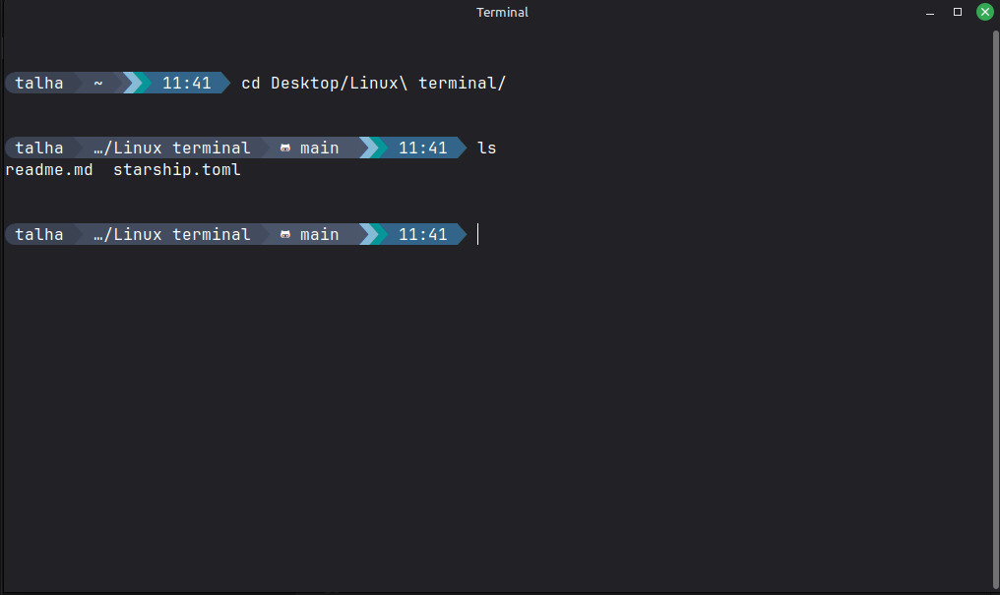

# 🚀 Starship Terminal Setup for Linux Mint / Ubuntu

A complete guide to transform your terminal into a beautiful, feature-rich prompt with icons, colors, and git integration using Starship.


*Your terminal will look like this after setup!*

---

## 📋 Table of Contents

- [What is Starship?](#what-is-starship)
- [Features](#features)
- [Prerequisites](#prerequisites)
- [Installation](#installation)
- [Configuration](#configuration)
- [Troubleshooting](#troubleshooting)
- [How Starship Works](#how-starship-works)
- [Customization](#customization)

---

## What is Starship?

Starship is a minimal, blazing-fast, and highly customizable prompt for any shell. It shows relevant information about your current directory, git status, programming languages, and much more.

---

## Features

- 🎨 **Beautiful Nord color scheme** with modern aesthetics
- 🔣 **Rich icon support** for files, folders, git, and programming languages
- 🐧 **OS detection** with custom icons (shows Linux Mint logo)
- 📁 **Smart directory truncation** with custom folder icons
- 🌿 **Git integration** showing branch, status, and changes
- 💻 **Language detection** for Python, Node.js, Rust, Go, Java, and more
- 🐍 **Conda/Virtual environment** indicators
- ⏱️ **Command duration** tracking
- 🎯 **Fast and lightweight** - written in Rust

---

## Prerequisites

- **Linux Mint** or **Ubuntu** (this guide is specifically for Debian-based distros)
- **Bash shell** (default on Linux Mint)
- **Internet connection** for downloading fonts and Starship
- **Terminal emulator** (GNOME Terminal, Mate Terminal, or similar)

---

## Installation

Follow these steps **in order** on your Linux Mint system:

### Step 1: Install Starship

```bash
# Download and install Starship binary
curl -sS https://starship.rs/install.sh | sh -s -- -y
```

This installs the Starship executable to `/usr/local/bin/starship`.

---

### Step 2: Enable Starship in Bash

```bash
# Add Starship initialization to your .bashrc
echo 'eval "$(starship init bash)"' >> ~/.bashrc
```

This tells Bash to load Starship every time you open a terminal.

---

### Step 3: Install Configuration File

```bash
# Create config directory if it doesn't exist
mkdir -p ~/.config

# Copy the starship.toml configuration from this repo
cp starship.toml ~/.config/starship.toml
```

**Note:** Make sure you've cloned this repository first, or download the `starship.toml` file directly. And you can also check `starship.sample.toml` starship file which has more icons and different color.

---

### Step 4: Install Nerd Fonts

Nerd Fonts are special fonts that include thousands of icons and symbols that Starship uses for its beautiful prompt.

#### Option A: Use the Provided Font Files

```bash
# Extract the fonts.zip from this repo
unzip fonts.zip -d NerdFonts

# Install to user fonts directory
mkdir -p ~/.local/share/fonts
cp NerdFonts/*.ttf ~/.local/share/fonts/

# Refresh font cache
fc-cache -fv
```

#### Option B: Download Manually

```bash
# Download FiraCode Nerd Font
cd ~/Downloads
wget https://github.com/ryanoasis/nerd-fonts/releases/download/v3.1.1/FiraCode.zip

# Extract
unzip FiraCode.zip -d FiraCode

# Install fonts
mkdir -p ~/.local/share/fonts
cp FiraCode/*.ttf ~/.local/share/fonts/

# Refresh font cache
fc-cache -fv
```

---

### Step 5: Install and Configure Nerd Font

**⚠️ CRITICAL STEP:** This is the most common reason icons don't show!

#### Install Font via GUI (Easiest Method):

1. **Open your file manager** and navigate to:
   ```
   ~/.local/share/fonts
   ```
   
2. **Find the font file** you want to use (e.g., `FiraCodeNerdFontMono-Regular.ttf`)

3. **Double-click** on the font file
   - A font preview window will open showing the font

4. **Click the "Install" button** in the top-right corner of the preview window

5. **Close the font preview window**

6. **Restart your terminal completely** (close all terminal windows and open a new one)

#### Configure Terminal to Use the Font:

After installing the font, you need to select it in your terminal settings:

**For GNOME Terminal / Mate Terminal:**

1. Open Terminal
2. Right-click → **Preferences** (or **Edit** → **Preferences**)
3. Select your **Profile** (usually "Default" or "Unnamed")
4. Go to the **"Text"** or **"Appearance"** tab
5. **UNCHECK** "Use the system fixed width font"
6. Click the **font selector button**
7. Search for or scroll to find: **`FiraCode Nerd Font Mono`**
8. Select **"FiraCode Nerd Font Mono Regular"**
9. Set size to `11` or `12`
10. Click **Select** or **OK**
11. **Close terminal completely** and open a new one

**For Other Terminals:**
- **xfce4-terminal**: Edit → Preferences → Appearance → Font
- **Konsole**: Settings → Edit Current Profile → Appearance → Font
- **Alacritty/Kitty**: Edit config file to specify font

---

### Step 6: Reload Bash

```bash
# Apply changes
source ~/.bashrc
```

**Or simply close and reopen your terminal.**

---

## Configuration

The included `starship.toml` file defines your prompt's appearance. Here's what it controls:

### Color Scheme: Nord Theme

The configuration uses the **Nord color palette**:
- `#3B4252` - Dark blue-gray (username/OS background)
- `#434C5E` - Medium gray (directory background)
- `#4C566A` - Light gray (git info background)
- `#86BBD8` - Cyan (programming languages)
- `#06969A` - Teal (docker/conda)
- `#33658A` - Blue (time display)

### Included Modules

The prompt displays the following information (left to right):

1. **OS Icon** - Shows Linux Mint logo (󰣭)
2. **Username** - Your current user
3. **Directory** - Current path with custom folder icons
4. **Git Branch & Status** - If in a git repository
5. **Programming Languages** - Auto-detected (Python, Node.js, Rust, etc.)
6. **Docker Context** - If Docker is active
7. **Conda Environment** - If using Anaconda/Miniconda
8. **Time** - Current time in 24-hour format
9. **Command Duration** - How long the last command took

---

## How Starship Works

Understanding Starship's structure helps you customize it:

### Anatomy of the Prompt

```toml
format = """
[](#3B4252)\
$username\
[](bg:#434C5E fg:#3B4252)\
$directory\
"""
```

**Components:**

1. **Powerline Separators** - `[]()` creates arrow-like shapes
   - `` is a Nerd Font character (Powerline triangle)
   - Colors are defined: `(bg:#434C5E fg:#3B4252)` means background color `#434C5E` and foreground (shape) color `#3B4252`
   
2. **Modules** - `$username`, `$directory`, `$git_branch`, etc.
   - These are placeholders that Starship replaces with actual content
   - Each module has its own configuration section below

3. **Module Configuration** - Defines what each module shows:
   ```toml
   [directory]
   style = "bg:#434C5E fg:#D8DEE9"    # Background and text colors
   format = "[ $path ]($style)"        # Layout: icon + path
   truncation_length = 3                # Show max 3 directories deep
   truncation_symbol = "…/"             # Use … when truncated
   ```

4. **Symbols/Icons** - Defined in each module:
   ```toml
   [git_branch]
   symbol = ""  # Nerd Font icon for git branch
   
   [nodejs]
   symbol = ""  # Node.js logo icon
   ```

### Module Structure

Every module follows this pattern:

```toml
[module_name]
symbol = ""           # Icon to display
style = "bg:#COLOR"   # Background/text colors
format = '[ $symbol ($version) ]($style)'  # How to arrange the content
```

---

## Troubleshooting

### Icons Show as Boxes (▯) or Question Marks (?)

**Cause:** Your terminal is not using a Nerd Font.

**Solution:**
1. Verify fonts are installed: `fc-list | grep -i "nerd"`
2. **MANUALLY** configure terminal font (see Step 5 above)
3. Select a font with **"Nerd Font Mono"** in the name
4. **Completely close and reopen terminal** (not just a new tab)

---

### Icons Show But With Extra Spacing

**Cause:** Using wrong font variant (proportional instead of monospaced).

**Solution:**
- Select **"FiraCode Nerd Font Mono"** (with "Mono")
- NOT "FiraCode Nerd Font" (without Mono)

---

### Some Icons Missing, Others Work

**Cause:** Font doesn't have full icon coverage.

**Solution:**
Try a different Nerd Font:
```bash
# Download JetBrains Mono Nerd Font
cd ~/Downloads
wget https://github.com/ryanoasis/nerd-fonts/releases/download/v3.1.1/JetBrainsMono.zip
unzip JetBrainsMono.zip -d JetBrainsMono
cp JetBrainsMono/*.ttf ~/.local/share/fonts/
fc-cache -fv
```

Then select **"JetBrainsMono Nerd Font Mono"** in terminal settings.

---

### Starship Not Loading

**Cause:** .bashrc not sourced or Starship not in PATH.

**Solution:**
```bash
# Check if Starship is installed
which starship

# Should output: /usr/local/bin/starship

# If not found, reinstall:
curl -sS https://starship.rs/install.sh | sh -s -- -y

# Verify .bashrc has the init line:
grep starship ~/.bashrc

# Should output: eval "$(starship init bash)"
```

---

### Colors Look Wrong

**Cause:** Terminal doesn't support true color.

**Solution:**
1. Use a modern terminal emulator (GNOME Terminal 3.16+, Alacritty, Kitty)
2. Check terminal settings for "Use colors from system theme" and disable it

---

## Customization

### Change Colors

Edit `~/.config/starship.toml` and modify the hex color codes:

```toml
[username]
style_user = "bg:#3B4252 fg:#D8DEE9"
#               ^^^^^^^^ background  ^^^^^^^^ text color
```

**Popular color schemes:**
- **Catppuccin Macchiato**: `#24273A`, `#B7BDF8`, `#F4DBD6`
- **Dracula**: `#282A36`, `#F8F8F2`, `#FF79C6`
- **Tokyo Night**: `#1A1B26`, `#C0CAF5`, `#7AA2F7`

---

### Add/Remove Modules

In the `format` string, add or remove module variables:

```toml
format = """
[](#3B4252)\
$os\
$username\
$battery\          # Add battery indicator
# $time\           # Comment out to remove time
"""
```

Available modules: `$battery`, `$memory_usage`, `$hostname`, `$aws`, etc.
See: https://starship.rs/config/

---

### Change Icons

Modify the `symbol` in each module:

```toml
[directory]
[directory.substitutions]
"Documents" = "󰈙 "     # Change to whatever icon you like
"Downloads" = " "
"Music" = "󰝚 "
```

**Find icons at:** https://www.nerdfonts.com/cheat-sheet

---

### Adjust Directory Truncation

```toml
[directory]
truncation_length = 5        # Show more directories
truncation_symbol = ".../"   # Change truncation indicator
```

---

## 📚 Resources

- **Starship Official Docs**: https://starship.rs/
- **Nerd Fonts**: https://www.nerdfonts.com/
- **Icon Cheat Sheet**: https://www.nerdfonts.com/cheat-sheet
- **Starship Presets**: https://starship.rs/presets/
- **Nord Color Palette**: https://www.nordtheme.com/

---

## 📝 Notes

- **Tested on**: Linux Mint 21.x and Ubuntu 22.04/24.04
- **Shell**: Bash (for Zsh, use `starship init zsh` instead)
- **Performance**: Starship is extremely fast (written in Rust)
- **Updates**: Run `curl -sS https://starship.rs/install.sh | sh` to update


---

## 📄 License

This configuration is provided as-is for personal use. Starship itself is licensed under the ISC License.

---

## 🙏 Credits

- **Starship**: https://github.com/starship/starship
- **Nerd Fonts**: https://github.com/ryanoasis/nerd-fonts
- **Nord Theme**: https://www.nordtheme.com/

---

**Enjoy your beautiful terminal! 🎉**

If icons don't show, remember: **Manually configure your terminal font settings!**